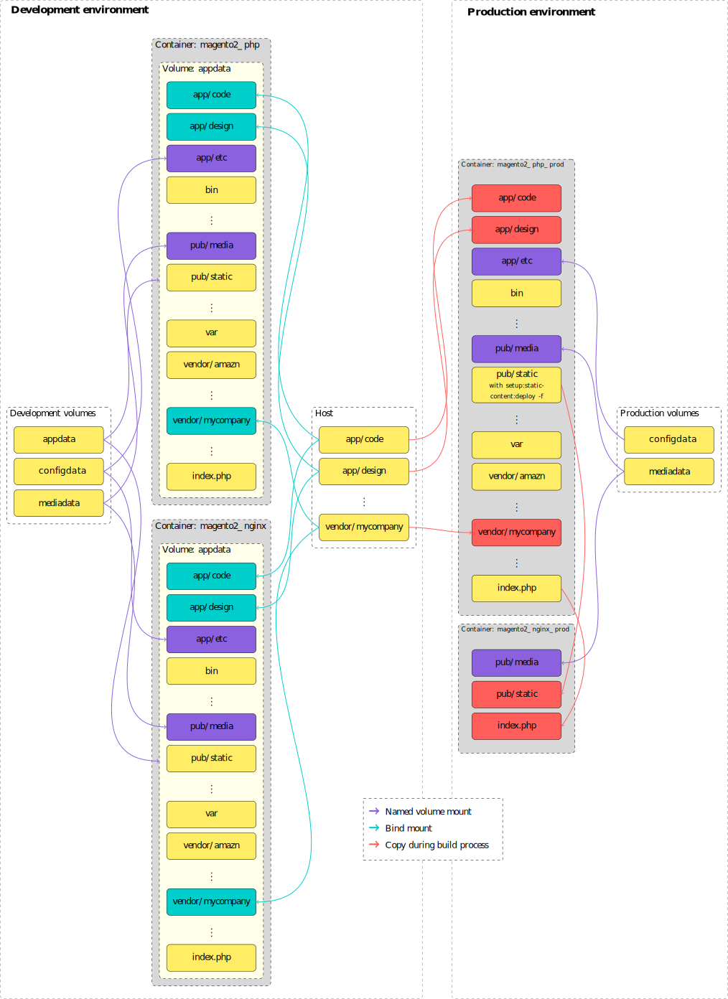

# Magento 2 Docker

Yet another composition of Docker containers to run Magento 2.

## Features

- Support **development** and **production** environments
- Use official containers if possible
- Use Alpine Linux if possible
- Follow best practices from [Docker](https://docs.docker.com/develop/develop-images/dockerfile_best-practices/)
- Closely follow the installation guide from [Magento 2](https://devdocs.magento.com/guides/v2.1/install-gde/prereq/prereq-overview.html)
- Aims to work on **Linux**, **Mac** (not tested yet) and **Windows**
- Easy deployment

## Containers

- PHP: [zsoerenm/magento2-php](https://hub.docker.com/r/zsoerenm/magento2-php/) based on [php:7-fpm-alpine](https://hub.docker.com/_/php/)
- MariaDB: [mariadb:10.2](https://hub.docker.com/_/mariadb/)
- Nginx: [zsoerenm/magento2-nginx](https://hub.docker.com/r/zsoerenm/magento2-nginx/) based on [nginx:alpine](https://hub.docker.com/_/nginx/)
- Redis: [redis:alpine](https://hub.docker.com/_/redis/)
- Cron: [zsoerenm/magento2-php](https://hub.docker.com/r/zsoerenm/magento2-php/) based on [php:7-fpm-alpine](https://hub.docker.com/_/php/)
- Varnish: [zsoerenm/magento2-varnish](https://hub.docker.com/r/zsoerenm/magento2-varnish/) based on [cooptilleuls/varnish:4-alpine](https://hub.docker.com/r/cooptilleuls/varnish/)
- SSL Proxy: [zsoerenm/magento2-sslproxy](https://hub.docker.com/r/zsoerenm/magento2-sslproxy/) based on [nginx:alpine](https://hub.docker.com/_/nginx/)

## Getting Started

### Prerequisities

Recommended shell for Windows is Powershell.

#### HTTPS during local development

Yes, this repository supports HTTPS during local development. This serves the best practice that the development environment should as close as possible to the production environment. Moreover, web browsers behave in subtly different ways on HTTP vs HTTPS pages. The main difference: On an HTTPS page, any requests to load JavaScript from an HTTP URL will be blocked [[see Let's Encrypt: Certificates for localhost](https://letsencrypt.org/docs/certificates-for-localhost/)].

The easiest way to create your own certificates is to use [mkcert](https://github.com/FiloSottile/mkcert). Generate a certificate for `localhost` and move both files into the `certs` directory. Adjust the sample names of the shared files for the `sslproxy` container in `docker-compose.yml` file according to file names that you just generated.

#### Get your source code into the container

By default the `php` container already ships with the Magento 2 source code. If you are happy with that, just go to the next section. Otherwise put your modified code into the `src` directory. Make sure that your code is compatible with the Magento 2 version that is inside the container. For reference: the `php` container has the same version as Magento 2 that's inside the container.



##### Development

For ease of development mount your modified code into the `php` and `web` container. However, I do not recommend to mount the complete Magento 2 source code into the container, because of performance reasons. Instead only mount those folders into the container, where you actually have modified / added source code. In the `docker-compose.yml` file you will find examples for `app/code` and `vendor/<some_vendor>`. If you still persist to mount the complete Magento 2 source code into the container and if you are using Linux or Mac, make sure that your files on the host have the correct write permissions according to [Set ownership and permissions for two users](https://devdocs.magento.com/guides/v2.2/install-gde/prereq/file-system-perms.html#perms-private). The group ID of the source code should be 82. This does not matter for Windows users as Docker-for-Windows mounts the files with [permission 777](https://docs.docker.com/docker-for-windows/troubleshoot/#volumes) anyway.

##### Production

For the **production** environment it is instead recommended to copy the source code into the container and omit the mount from host to container. Moreover, this repository implements the [suggested pipeline deployment](https://devdocs.magento.com/guides/v2.2/config-guide/deployment/pipeline/technical-details.html) from Magento. It enables a fast deployment with a very short offline interval compared to the conventional deployment process. See the section "From development to production environment" below for further details.

*Note:* The `php` container does NOT ship with `composer`. This is to keep the container as slim as possible. Any modification to the source code should be done on the host. You could still use the [official composer container](https://hub.docker.com/_/composer/) to install `composer` modules if you do not want to install `composer` on the host.

### Usage

In a development environment simply run

```shell
docker-compose up
```
and head to `http://localhost/` (or whatever you set up under `SERVER_NAME` for the `sslproxy` container in `docker-compose.yml`). You should automatically be redirected to HTTPS.

#### Environment Variables

##### PHP
You can set any configuration which you would normally set in the admin backend. [Here](https://devdocs.magento.com/guides/v2.2/config-guide/deployment/pipeline/example/environment-variables.html) you will find more on how to set configurations using environment variables.

- Example: `CONFIG__DEFAULT__GENERAL__STORE_INFORMATION__NAME=Foobar` - Optional - sets config for `general/store_information/name`

You can also change the Redis and database configuration. Those will, however, only take effect if Magento has already been installed. If you haven't installed Magento, run the installation and restart the container.

- `BACKEND_FRONTNAME` - Optional
- `HOST_NAME` - Optional

- `DEFAULT_CACHE_REDIS_SERVER` - Optional
- `DEFAULT_CACHE_REDIS_PORT` - Optional
- `DEFAULT_CACHE_REDIS_DATABASE` - Optional
- `DEFAULT_CACHE_REDIS_PASSWORD` - Optional

- `PAGE_CACHE_REDIS_SERVER` - Optional
- `PAGE_CACHE_REDIS_PORT` - Optional
- `PAGE_CACHE_REDIS_DATABASE` - Optional
- `PAGE_CACHE_REDIS_PASSWORD` - Optional
- `PAGE_CACHE_REDIS_COMPRESS_DATA` - Optional

- `SESSION_REDIS_SERVER` - Optional
- `SESSION_REDIS_PORT` - Optional
- `SESSION_REDIS_DATABASE` - Optional
- `SESSION_REDIS_PASSWORD` - Optional
- `SESSION_REDIS_COMPRESS_DATA` - Optional
- `SESSION_REDIS_TIMEOUT` - Optional
- `SESSION_REDIS_PERSISTENT_IDENTIFIER` - Optional
- `SESSION_REDIS_COMPRESSION_THRESHOLD` - Optional
- `SESSION_REDIS_COMPRESSION_LIBRARY` - Optional
- `SESSION_REDIS_MAX_CONCURRENCY` - Optional
- `SESSION_REDIS_BREAK_AFTER_FRONTEND` - Optional
- `SESSION_REDIS_BREAK_AFTER_ADMINHTML` - Optional
- `SESSION_REDIS_FIRST_LIFETIME` - Optional
- `SESSION_REDIS_BOT_FIRST_LIFETIME` - Optional
- `SESSION_REDIS_BOT_LIFETIME` - Optional
- `SESSION_REDIS_DISABLE_LOCKING` - Optional
- `SESSION_REDIS_MIN_LIFETIME` - Optional
- `SESSION_REDIS_MAX_LIFETIME` - Optional
- `SESSION_REDIS_SENTINEL_MASTER` - Optional
- `SESSION_REDIS_SENTINEL_SERVERS` - Optional
- `SESSION_REDIS_SENTINEL_VERIFY_MASTER` - Optional
- `SESSION_REDIS_SENTINEL_CONNECT_RETIRES` - Optional

- `MYSQL_HOST` - Optional
- `MYSQL_DATABASE` - Optional
- `MYSQL_USER` - Optional
- `MYSQL_PASSWORD` - Optional
- `MYSQL_DB_ENGINE` - Optional
- `MYSQL_DB_PREFIX` - Optional
- `MYSQL_DB_MODEL` - Optional
- `MYSQL_DB_INIT_STATEMENTS` - Optional

##### Database

- `MYSQL_ROOT_PASSWORD` - Optional, Required on first run
- `MYSQL_DATABASE` - Optional, Required on first run
- `MYSQL_USER` - Optional, Required on first run
- `MYSQL_PASSWORD` - Optional, Required on first run

##### Web

- `BACKEND_HOST` - Required - Must be set to the php host
- `SERVER_NAME` - Required - Server name must be identical to the name of the container

##### SSL Proxy

- `BACKEND_HOST` - Required - Must be set to the varnish host
- `SERVER_NAME` - Required - The server name that you'd like to type in the browser

## Install Magento 2

You can either install Magento 2 from scratch or start with existing database

### Install from scratch

There is nothing more to do other than starting docker-compose with `docker-compose up` and heading to https://localhost .
You may also install Magento using the command line:
```bash
docker-compose exec php bin/magento setup:install
```
The database host is the name of the database container (default: `db`). The database username, password etc. is what you have set in `docker-compose.yml` file in the database section. Make sure that you set HTTPS for frontend and backend in the advanced settings.

**Note:** If you use Varnish, the Browser output will "freeze" around 20% (at least for me) during the installation. But don't worry the installation will finish in the background. It's probably a bug in Magento. Simply browse to `http://localhost/` periodically in another tab to see if the installation has finished.

### Install from an existing installation

1. Copy your `app/etc/env.php` and `app/etc/config.php` from your previous installation into the new installation. For example<br />
*Linux and Mac:*
```bash
docker cp ./src/app/etc/env.php $(docker-compose ps -q php):/var/www/html/app/etc/env.php
docker cp ./src/app/etc/config.php $(docker-compose ps -q php):/var/www/html/app/etc/config.php
docker-compose exec php chown magento:www-data app/etc/env.php app/etc/config.php
docker-compose exec php chmod 664 app/etc/env.php app/etc/config.php
```
*Windows:*
```bash
$phpid = $(docker-compose ps -q php)
docker cp ./src/app/etc/env.php ${phpid}:/var/www/html/app/etc/env.php
docker cp ./src/app/etc/config.php ${phpid}:/var/www/html/app/etc/config.php
docker-compose exec php chown magento:www-data app/etc/env.php app/etc/config.php
docker-compose exec php chmod 664 app/etc/env.php app/etc/config.php
```
2. Import the database (replace `PASSWORD` with the database root password, `DATABASE` with the database name (e.g. `magento2`) and `backup.sql` with the name of the database SQL file):
```bash
cat backup.sql | docker exec -i $(docker-compose ps -q db) /usr/bin/mysql -u root --password=PASSWORD DATABASE
```
3. Optionally adjust the MySQL host, database, user and password in `app/etc/env.php` by setting the following environment variables for the php container (see above) and restart the `php` container:
  - `MYSQL_HOST`
  - `MYSQL_DATABASE`
  - `MYSQL_USER`
  - `MYSQL_PASSWORD`
4. Run
```bash
docker-compose exec php bin/magento setup:di:compile
```
(*Note:* For me this throws the following RuntimeException: `Source class "\scopesConfigSourceAggregated" for "scopesConfigSourceAggregatedProxy" generation does not exist.` but it works anyway. If anyone comes up with a better solution, file an issue and let me know!)

## Backup MySQL database

Linux and Mac:
```bash
docker exec CONTAINER /usr/bin/mysqldump -u root --password=PASSWORD DATABASE > backup.sql
```
Windows:
```bash
docker exec CONTAINER /usr/bin/mysqldump -u root --password=PASSWORD DATABASE | Set-Content backup.sql
```

## From development to production environment

### This is still WIP!

This repository implements the [recommended deployment](https://devdocs.magento.com/guides/v2.2/config-guide/deployment/pipeline/technical-details.html) process from Magento with the help of Docker containers.
The process is as follows:
1. Dump your configuration on the development machine:
```bash
docker-compose exec php bin/magento app:config:dump
```
2. Copy the `app/etc/config.php` to your development host
```bash
docker cp $(docker-compose ps -q php):/var/www/html/app/etc/config.php ./src/app/etc/config.php
```
(*Note:* Replace `$(docker-compose ps -q php)` with the id of the php container if you use Windows)
3. Build the php container for production
```bash
docker build -f php/Dockerfile -t magento2-php-prod .
```
4. Build the nginx container for production
```bash
docker build -f nginx/Dockerfile -t magento2-nginx-prod .
```
Note: The nginx Dockerfile refers to `magento2-php-prod` to copy some files. So make sure that you name the `php` image `magento2-php-prod`.
5. Move the `php` and `nginx` image to your production environment
6. Run the following on your production machine
```bash
docker-compose up -f prod.docker-compose.yml
```

## Q&A

- The following error is thrown when php container for production is build

```bash
+ php bin/magento setup:static-content:deploy -f

Deploy using quick strategy

  [DomainException]
  Default website is not defined
```
*Answer:* Make sure you have run `app:config:dump` (example: `docker-compose exec php bin/magento app:config:dump`) and copied `app/etc/config.php` to the host.

- When building the php container I get the following error:

```bash
You cannot run this command because modules are not enabled. You can enable modules by running the 'module:enable --all' command.
```
*Answer:* Put your `config.php` into `src/app/etc/`. If you run Magento 2 locally you can do that in the following way:
```bash
docker cp $(docker-compose ps -q php):/var/www/html/app/etc/config.php ./src/app/etc/config.php
```

## Todos

- Make Varnish optional (For PWA is does not really makes sense)
- Add Let's encrypt example for production
- Add Elasticsearch (since Magento 2.3 it will be supported by CE version)
- Add a periodic MySQL backup

## License

This project is licensed under the MIT License - see the [LICENSE.md](LICENSE.md) file for details.
Magento 2 is licensed under their [official license](https://github.com/magento/magento2/blob/2.3-develop/LICENSE.txt).
